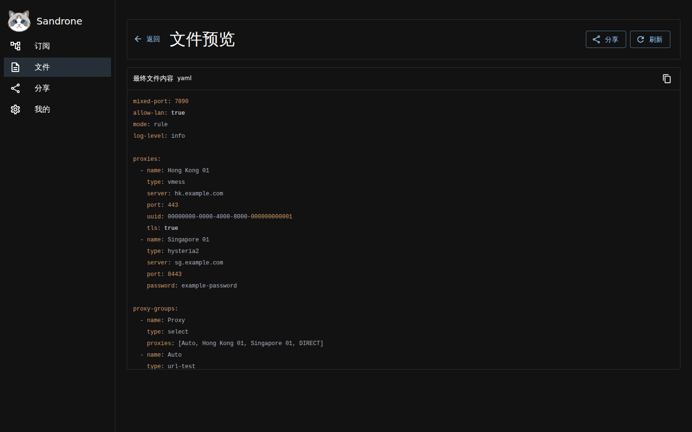

<div align="center">
  
  <h1>Sandrone</h1>
  <p><strong>把零散订阅变成可维护、可验证、可分享的客户端配置。</strong></p>
  <p>A self-hosted proxy configuration workbench — from subscription sources to client-ready configs.</p>
  <p>
    <a href="https://github.com/kuuvahki-labs/sandrone/actions/workflows/ci.yml"></a>
    <a href="https://github.com/kuuvahki-labs/sandrone/releases"></a>
    <a href="LICENSE"></a>
    <a href="Dockerfile"></a>
    <a href="docs/reference/mcp.md"></a>
  </p>
</div>

Sandrone 管理本地与远程订阅，通过统一的 `NodeIR` 执行有序处理链，再生成
Mihomo、sing-box、Shadowrocket 配置或分享链接。同一套转换语义同时服务于
Web UI、CLI、HTTP API、MCP 与可嵌入 Go API。

如果你需要的不是一次性的格式转换，而是一套可以长期维护的自托管配置工作流，
Sandrone 就是为此而做。觉得它有用，欢迎点一个 Star，让更多同类用户找到它。

<p align="center">
  
</p>

## 为什么是 Sandrone

- **从订阅到完整配置**：聚合多个来源，处理节点，再生成带代理组、规则和 DNS
  设置的客户端配置，不止转换分享 URI。
- **先看清，再交付**：在保存或分享前预览节点变化和最终文件；通过结构化 warning、
  validate 与 Mihomo / sing-box 探测发现有损字段和不可用节点。
- **可视化，也可自动化**：Web UI 适合日常管理；CLI、HTTP API、MCP 与 Go API
  复用相同的 service 层，脚本和 Agent 不需要另造一套流程。
- **扩展但不失控**：filter、dedup、rename、sort、probe 等内建 processor 与受限
  JavaScript 可按声明顺序组合；远程读取、缓存和探测都经过受控边界。
- **轻量自托管**：默认是一个内嵌 Web UI 的 Go 二进制，不要求数据库或额外常驻
  runtime；也提供多架构容器、文件系统 / S3 存储和 Vercel 部署路径。

## 60 秒启动

需要 Docker 与 Docker Compose：

```sh
git clone https://github.com/kuuvahki-labs/sandrone.git
cd sandrone
docker compose up --pull always
```

打开 <http://127.0.0.1:1137>。Compose 默认使用仅供本地试用的 bearer token
`sandrone`，数据保存在 `sandrone-data` volume。对外提供服务前必须设置新的
`SANDRONE_TOKEN`。

确认服务状态：

```sh
curl http://127.0.0.1:1137/version
```

第一次使用可以直接跟着[Web UI 教程](docs/tutorials/first-web-ui.md)完成一条从
订阅到 Mihomo 文件的工作流；偏好命令行则从[第一次转换](docs/tutorials/first-conversion.md)
开始。

## 一条配置如何产生

```text
本地内容 / 远程订阅
          ↓
       统一 NodeIR
          ↓
过滤 → 去重 → 重命名 → 排序 → 探测 → 受限脚本
          ↓
Mihomo / sing-box / Shadowrocket 完整配置
          ↓
     预览、下载或分享链接
```

每一步都有稳定契约：格式能力见[格式与能力参考](docs/reference/capabilities.md)，
节点与文件处理语义见 [Processors 参考](docs/reference/processors.md)，完整配置的
生成方式见[渲染客户端配置](docs/how-to/render-client-config.md)。

## 能力概览

| 范围 | 当前能力 |
| --- | --- |
| 输入 | 单条分享 URI、URI 列表、Base64 订阅、Mihomo YAML / JSON、sing-box JSON |
| 节点处理 | filter、dedup、rename、sort、quick settings、probe、sandboxed JavaScript |
| 节点输出 | Mihomo proxies、sing-box outbounds / endpoints、Shadowrocket `[Proxy]`、URI 列表 |
| 完整文件 | Mihomo、sing-box、Shadowrocket typed config，以及 static / remote file |
| 文件处理 | YAML / JSON / INI merge、JSON Patch、template 与 sandboxed JavaScript |
| 运行能力 | preview、validate、TCP / UDP / URL probe、缓存、定时刷新、分享、备份与恢复 |
| 接入方式 | Web UI、CLI、HTTP API、MCP Streamable HTTP、`pkg/sandrone` Go API |

格式转换存在目标客户端无法表达的边界。Sandrone 会保留可保留的原始字段并返回
warning，不把“成功输出”伪装成“完全无损”；精确范围以
[capability catalog](docs/reference/capabilities.md) 为准。

## 部署与集成

| 场景 | 入口 |
| --- | --- |
| 本机或服务器自托管 | [Docker Compose](docker-compose.yaml) |
| OpenWrt、NAS 或独立主机 | [GitHub Releases](https://github.com/kuuvahki-labs/sandrone/releases) 中的多架构单文件包 |
| Vercel + 私有对象存储 | [部署到 Vercel 与 Cloudflare R2](docs/how-to/deploy-vercel-r2.md) |
| Shell 与自动化任务 | [CLI 参考](docs/reference/cli.md) |
| 应用或前端集成 | [HTTP API 参考](docs/reference/http-api/README.md) |
| AI Agent | [MCP 参考](docs/reference/mcp.md)与 [`skills/sandrone`](skills/sandrone) |
| Go 程序内嵌 | [`pkg/sandrone`](pkg/sandrone) |

## 文档

- [文档索引](docs/README.md)：教程、操作指南、契约与架构的唯一导航入口。
- [架构总览](docs/architecture/overview.md)：理解分层、数据流与扩展边界。
- [FileSpec 参考](docs/reference/file-spec.md)：完整客户端文件的来源、类型与设置。
- [社区配置预设](docs/reference/community-config-presets.md)：Web 预设的生成行为、风险与依赖。
- [贡献指南](CONTRIBUTING.md)：开发流程、测试范围与提交要求。

## 隐私与安全

订阅与生成配置通常包含连接凭据。不要在 issue、PR、日志、fixture 或文档示例中
提交真实订阅链接、节点 URI、token、cookie、私钥、真实服务地址或未脱敏配置。
安全漏洞请按[安全策略](SECURITY.md)使用 GitHub private vulnerability reporting
报告，不要公开披露细节。

Sandrone 采用 [AGPL-3.0-or-later](LICENSE) 许可证。

<details>
<summary>致谢</summary>

Sandrone 的格式与客户端生态建立在这些项目和协议实现之上：

- [MetaCubeX/mihomo](https://github.com/MetaCubeX/mihomo)
- [SagerNet/sing-box](https://github.com/SagerNet/sing-box)
- [LOWERTOP/Shadowrocket](https://github.com/LOWERTOP/Shadowrocket)
- [blackmatrix7/ios_rule_script](https://github.com/blackmatrix7/ios_rule_script)
- [tindy2013/subconverter](https://github.com/tindy2013/subconverter)
- [sub-store-org/Sub-Store](https://github.com/sub-store-org/Sub-Store)
- [shadowsocks/shadowsocks-org](https://github.com/shadowsocks/shadowsocks-org)
- [v2fly/v2fly-github-io](https://github.com/v2fly/v2fly-github-io)
- [XTLS/Xray-core](https://github.com/XTLS/Xray-core)
- [trojan-gfw/trojan](https://github.com/trojan-gfw/trojan)
- [apernet/hysteria](https://github.com/apernet/hysteria)
- [tuic-protocol/tuic](https://github.com/tuic-protocol/tuic)
- [WireGuard/wireguard-go](https://github.com/WireGuard/wireguard-go)

</details>
