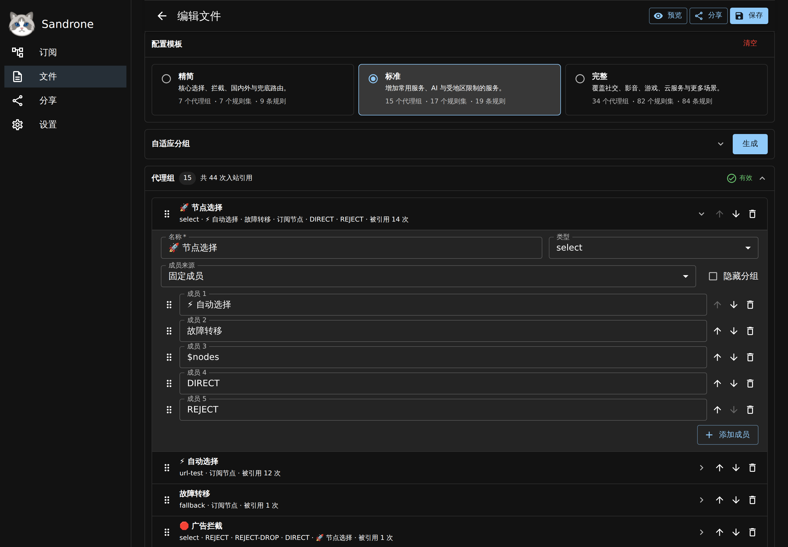
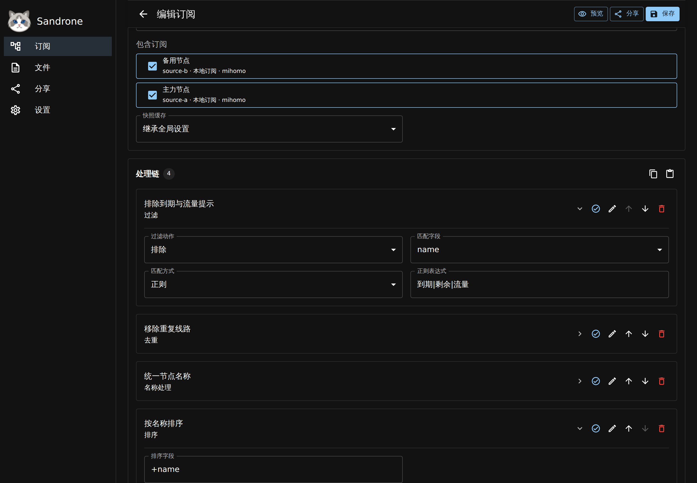
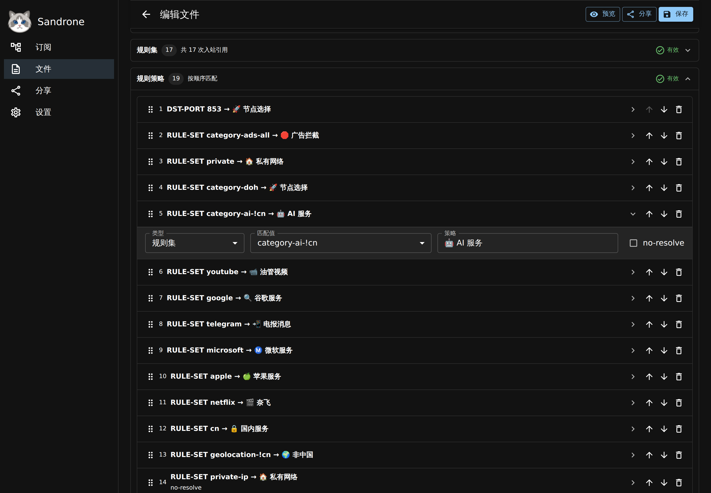

<div align="center">
  
  <h1>Sandrone</h1>
  <p><strong>把零散订阅变成可维护、可验证、可分享的客户端配置。</strong></p>
  <p>A self-hosted proxy configuration workbench — from subscription sources to client-ready configs.</p>
  <p>
    <a href="https://github.com/kuuvahki-labs/sandrone/actions/workflows/ci.yml"></a>
    <a href="https://github.com/kuuvahki-labs/sandrone/releases"></a>
    <a href="LICENSE"></a>
    <a href="Dockerfile"></a>
    <a href="docs/reference/mcp.md"></a>
  </p>
</div>

Sandrone 是一个可自托管的订阅与客户端配置工作台。在网页中组合和整理订阅，
选择配置模板，编辑代理组、规则集与分流规则，再生成、检查和分享
Mihomo、sing-box 或 Shadowrocket 配置。

也支持命令行、HTTP API 和 MCP，可通过 Go API 嵌入其他程序。

[](docs/screenshots/config-editor.png)

选择配置模板，编辑代理组的类型、成员与引用关系。

## 为什么是 Sandrone

把多个来源的订阅汇总、整理，再生成适合不同客户端的配置，日常维护集中在一处。

- **聚合多个来源**：远程订阅、本地节点和已有订阅可以自由组合，
  按用途组织成不同的订阅，供手机、电脑等设备使用。
- **节点整理省去手工操作**：按需筛选、去重、统一名称和排序，也可以根据
  探测结果保留或排列节点；保存整理规则后，每次生成都会沿用。
- **开箱即用的完整配置**：内置客户端模板和常用预设，提供分组、分流规则与
  DNS 设置，帮助你从订阅生成客户端配置，减少从零编写的工作。
- **通过界面维护客户端配置**：选择内置模板，编辑代理组的类型与成员，管理
  规则集来源，调整分流规则的匹配条件、目标策略和顺序。
- **默认好用，也能灵活定制**：通过基础配置编辑调整 DNS 等设置，按需组合或
  移除预设；有更细的需求时，可以编辑原始配置或用脚本扩展节点与文件处理。
- **结果可检查，配置易交付**：预览节点处理前后的变化和最终配置，查看兼容性
  提醒、测试节点可用性，再下载或生成分享链接，添加到对应客户端。
- **日常管理与自动化兼顾**：平时通过网页操作，也可设置定时刷新，或通过
  命令行、API 和 MCP 接入自己的自动化流程，减少重复维护。
- **轻量自托管**：一个带 Web UI 的程序或容器即可部署，无需额外数据库，
  订阅与配置保存在自己管理的存储中，并支持备份和迁移。

## 60 秒启动

需要 Docker 与 Docker Compose：

```sh
git clone https://github.com/kuuvahki-labs/sandrone.git
cd sandrone
docker compose up --pull always
```

打开 <http://127.0.0.1:1137>。Compose 默认使用仅供本地试用的 bearer token
`sandrone`，数据保存在 `sandrone-data` volume。对外提供服务前必须设置新的
`SANDRONE_TOKEN`。

确认服务状态：

```sh
curl http://127.0.0.1:1137/version
```

第一次使用可以直接跟着[Web UI 教程](docs/tutorials/first-web-ui.md)完成一条从
订阅到 Mihomo 文件的工作流；偏好命令行则从[第一次转换](docs/tutorials/first-conversion.md)
开始。

## 界面示例

**订阅组合与处理链**

[](docs/screenshots/subscription-processors.png)

组合多个订阅，通过过滤、去重、重命名和排序整理节点。

**分流规则编辑**

[](docs/screenshots/routing-rules.png)

编辑分流规则的匹配条件和目标策略，并调整匹配顺序。

[查看规则集与分流配置](docs/screenshots/config-editor-lower.png)。

## 一条配置如何产生

```text
本地内容 / 远程订阅
          ↓
  组合订阅，按需整理节点
          ↓
选择模板，编辑代理组、规则集与分流规则
          ↓
 按需调整基础配置与文件处理
          ↓
Mihomo / sing-box 完整配置，或 Shadowrocket 无节点配置
          ↓
     预览、下载或分享链接
```

格式能力见[格式与能力参考](docs/reference/capabilities.md)，
节点与文件处理语义见 [Processors 参考](docs/reference/processors.md)，完整配置的
生成方式见[渲染客户端配置](docs/how-to/render-client-config.md)。

## 能力概览

| 范围 | 当前能力 |
| --- | --- |
| 输入 | 单条分享 URI、URI 列表、Base64 订阅、Mihomo YAML / JSON、sing-box JSON |
| 节点处理 | filter、dedup、rename、sort、quick settings、probe、sandboxed JavaScript |
| 图形化配置 | 模板选择、代理组、规则集与分流规则编辑；基础配置原文编辑 |
| 节点输出 | Mihomo proxies、sing-box outbounds / endpoints、Shadowrocket Subscribe（Clash YAML 别名）、Base64 / URI 列表 |
| 完整文件 | Mihomo、sing-box typed config、Shadowrocket 无节点 typed config，以及 static / remote file |
| 文件处理 | YAML / JSON / INI merge、JSON Patch、template 与 sandboxed JavaScript |
| 运行能力 | preview、CLI diagnose、声明式 TCP / UDP / URL probe、缓存、定时刷新、分享、备份与恢复 |
| 接入方式 | Web UI、CLI、HTTP API、MCP Streamable HTTP、`pkg/sandrone` Go API |

格式转换受目标客户端能力限制，无法完整保留的字段会返回兼容性提醒。
具体支持范围见[格式与能力参考](docs/reference/capabilities.md)。

## 部署与集成

| 场景 | 入口 |
| --- | --- |
| 本机或服务器自托管 | [Docker Compose](docker-compose.yaml) |
| OpenWrt、NAS 或独立主机 | [GitHub Releases](https://github.com/kuuvahki-labs/sandrone/releases) 中的多架构单文件包 |
| Vercel + 私有对象存储 | [部署到 Vercel 与 Cloudflare R2](docs/how-to/deploy-vercel-r2.md) |
| Shell 与自动化任务 | [CLI 参考](docs/reference/cli.md) |
| 应用或前端集成 | [HTTP API 参考](docs/reference/http-api/README.md) |
| AI Agent | [MCP 参考](docs/reference/mcp.md)与 [`skills/sandrone`](skills/sandrone) |
| Go 程序内嵌 | [`pkg/sandrone`](pkg/sandrone) |

## 文档

- [文档索引](docs/README.md)：教程、操作指南、契约与架构导航。
- [架构总览](docs/architecture/overview.md)：理解分层、数据流与扩展边界。
- [FileSpec 参考](docs/reference/file-spec.md)：完整客户端文件的来源、类型与设置。
- [社区配置预设](docs/reference/community-config-presets.md)：Web 预设的生成行为、风险与依赖。
- [贡献指南](CONTRIBUTING.md)：开发流程、测试范围与提交要求。

## 隐私与安全

订阅与生成配置通常包含连接凭据。不要在 issue、PR、日志、fixture 或文档示例中
提交真实订阅链接、节点 URI、token、cookie、私钥、真实服务地址或未脱敏配置。
安全漏洞请按[安全策略](SECURITY.md)使用 GitHub private vulnerability reporting
报告，不要公开披露细节。

Sandrone 采用 [AGPL-3.0-or-later](LICENSE) 许可证。

<details>
<summary>致谢</summary>

Sandrone 的格式与客户端生态建立在这些项目和协议实现之上：

- [MetaCubeX/mihomo](https://github.com/MetaCubeX/mihomo)
- [SagerNet/sing-box](https://github.com/SagerNet/sing-box)
- [LOWERTOP/Shadowrocket](https://github.com/LOWERTOP/Shadowrocket)
- [blackmatrix7/ios_rule_script](https://github.com/blackmatrix7/ios_rule_script)
- [tindy2013/subconverter](https://github.com/tindy2013/subconverter)
- [sub-store-org/Sub-Store](https://github.com/sub-store-org/Sub-Store)
- [shadowsocks/shadowsocks-org](https://github.com/shadowsocks/shadowsocks-org)
- [v2fly/v2fly-github-io](https://github.com/v2fly/v2fly-github-io)
- [XTLS/Xray-core](https://github.com/XTLS/Xray-core)
- [trojan-gfw/trojan](https://github.com/trojan-gfw/trojan)
- [apernet/hysteria](https://github.com/apernet/hysteria)
- [tuic-protocol/tuic](https://github.com/tuic-protocol/tuic)
- [WireGuard/wireguard-go](https://github.com/WireGuard/wireguard-go)

</details>
